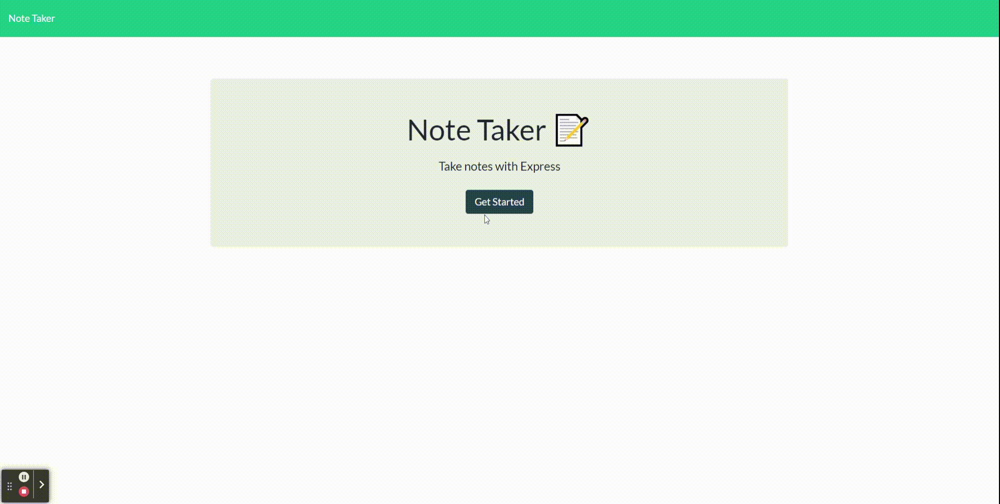

# Note Taker

## Description

An application that allows users to quickly create, save, and delete notes. All notes are stored inside a data JSON file on the server, which is usaully updated when a note is created/deleted or retrieved when the application needs it.

## Table of Content

- [Description](#description)
- [Installation](#installation)
- [Usage](#usage)
- [Demo](#demo)
- [Page Link](#page-link)
- [Questions](#questions)

## Installation

- Clone the repository from https://github.com/ptran77/note-taker
- run 'npm i' to install all necessary packages

## Usage

Two ways to run the application:

1. enter 'node server' to run the program and open up http://localhost:3001/
2. go the to live application on https://note-taker-pt.herokuapp.com/

After getting to site, users can make a note with a title and text and hit the floppy disk icon to save the note. Users can create and save more notes or delete notes by pressing the red trash icon.

## Demo

## Page Link

Page Link: https://note-taker-pt.herokuapp.com/

## Questions

Github: [ptran77](https://github.com/ptran77)

For any questions, contact me at pettran866@gmail.com
